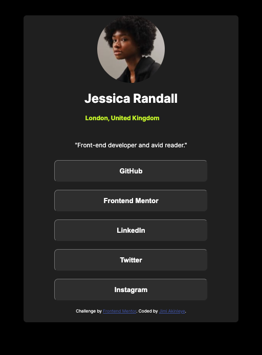
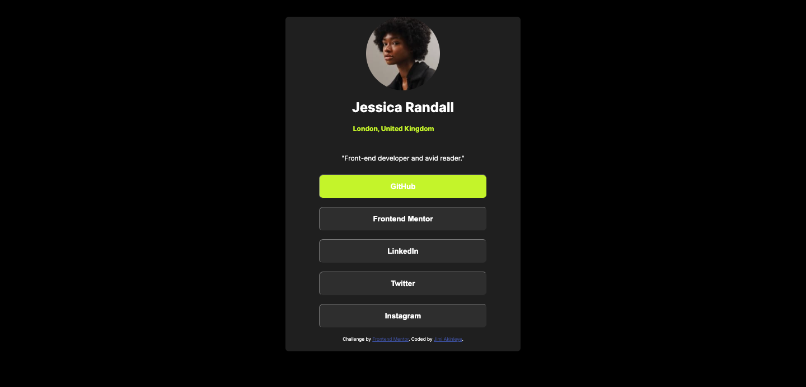
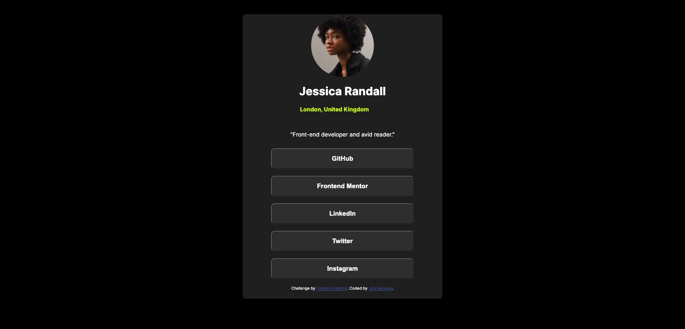

# Frontend Mentor - Social links profile solution

This is a solution to the [Social links profile challenge on Frontend Mentor](https://www.frontendmentor.io/challenges/social-links-profile-UG32l9m6dQ). Frontend Mentor challenges help you improve your coding skills by building realistic projects. 

## Table of contents

- [Overview](#overview)
  - [The challenge](#the-challenge)
  - [Screenshot](#screenshot)
  - [Links](#links)
- [My process](#my-process)
  - [Built with](#built-with)
  - [What I learned](#what-i-learned)
  - [Continued development](#continued-development)
  - [Useful resources](#useful-resources)
- [Author](#author)
- [Acknowledgments](#acknowledgments)

## Overview

Built a simple profile card

### The challenge

Users should be able to:

- See hover and focus states for all interactive elements on the page

### Screenshot

### Links

- Solution URL: https://frontend-mentor-social-media-profile.pages.dev/
- Live Site URL: [Add live site URL here](https://your-live-site-url.com)

## My process

Started with the HTML, built the markup and then styled them.

### Built with

- Semantic HTML5 markup
- CSS custom properties
- Flexbox
- CSS Grid
- Mobile-first workflow

### What I learned

Hover and focus effects, strengthened the use of margins and flex containers. 

To see how you can add code snippets, see below:

### Continued development

Javascript, but I didn't write any here, so, no worries.

## Author

- Website - [Jimi Akinleye](https://github.com/Agewiser)
- Frontend Mentor - [@yourusername](https://www.frontendmentor.io/profile/Agewiser)
- Twitter - [@yourusername](https://www.twitter.com/adejimi)

